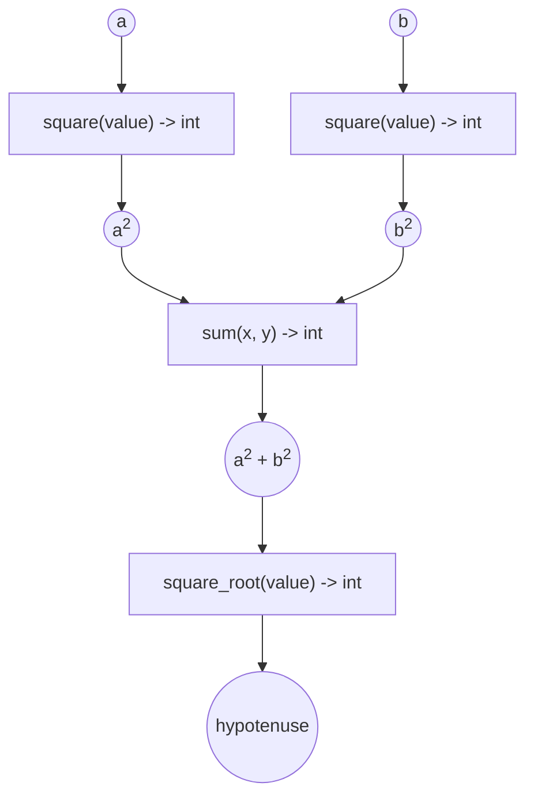

# Joining tasks

Spider provides two methods for joining tasks together:

1. Binding the output(s) of one task to the input(s) of another.
2. Starting a task from within another task.

(1) is useful when you simply want to assemble a directed acyclic graph (DAG) of tasks. (2) is
useful when you want a task to act like a client itself, running, monitoring, and collecting the
output of Spider jobs.

## Binding tasks together

The `spider::Driver::bind` function allows you to bind two or more tasks together. For example, we
can compute the hypotenuse of a right-angle triangle using the DAG of tasks shown in Figure 1 below.

*Figure 1: A DAG of tasks to calculate the hypotenuse of a right-angle triangle. Square blocks
represent tasks and circular blocks represent values.*

This DAG of tasks is implemented in `examples/joining-tasks/src/`.

> [!NOTE]
> To build and run the example, you can follow the steps from the quick-start guide, but from inside
> the `examples/joining-tasks` directory.

`spider::Driver::bind` takes two or more parameters as input:

- The first parameter is the *target* task or `TaskGraph` that will take (as inputs) the outputs of
  any tasks or `TaskGraph`s bound to it. For brevity, we’ll collectively refer to tasks and
  `TaskGraph`s as *runnables*.
- Each subsequent parameter is a either a *source* runnable, or a value that conforms to the
  `Serializable` or `Data` interfaces.
- If the parameter is a runnable, its outputs will be passed to the inputs of the target runnable
  (which is why we call it a source runnable).

In the example:

- We first use `bind` to bind the outputs of two `square` tasks to the inputs of the `sum` tasks.
  This invocation returns a `TaskGraph` that we store in `sum_of_squares_task_graph`.
- Next, we use `bind` again to bind the output of `sum_of_squares_task_graph` to the input of the
  `square_root` task, storing the result in `hypotenuse_task_graph`. `hypotenuse_task_graph`
  represents the DAG in Figure 1.
- Finally, we submit `hypotenuse_task_graph` for execution with the inputs `4` & `5`.

### Ordering of bound inputs

Notice that the values we pass to `spider::Driver::bind` and `spider::Driver::start` are distributed
to the inputs of the target runnable, from left-to-right. In the example, the output of the first
`square` task is passed to the first input of `sum`, and likewise for the second `square` task and
input. Similarly, in `spider::Driver::start`, `4` is passed to the left `square` task and `5` is
passed to the right `square` task.

> [!NOTE]
> Unlike `std::bind`, `spider::Driver::bind` doesn’t support placeholder inputs.

>
>

## Nesting tasks

To run a task from within another task, you can use the task’s`TaskContext` parameter (the first
parameter) similar to how we use `spider::Driver`. Specifically, both have `bind` and `start`
methods with equivalent parameters and return values.
